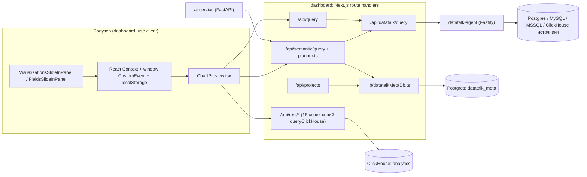

# Pocket Analyst — Engineering System Audit

Дата: 2026-09-24. Аудит выполнен в режиме только чтения: код, конфигурация и история Git не изменялись, тесты, `tsc`, `eslint` и `next build` не запускались (они пишут кэши и артефакты). Этот файл — единственное, что было создано, по явной просьбе владельца.

Аудит проводился в четыре этапа: разделы 1–4, затем 5–7 и 10, затем 8–9, затем 11–21. Упоминания «этапа 1/2/3» внутри текста относятся к этим этапам аудита. «Этапы 0–5» в разделах 20–21 — это этапы предлагаемого плана миграции, это другое.

**Обозначения.** **[Факт]** — видно в коде. **[Вывод]** — следует из кода, но не проверено запуском. **[UNKNOWN]** — нужно дополнительное исследование. Рекомендации в разделах 12–21 — проект, не реализация. Для каждой указан отказ, который она предотвращает.

**Главное в одном абзаце.** Ядро семантического слоя (`lib/semantic`) устроено хорошо: чистый TypeScript без React, зависимости без циклов, одна грамматика формул. Главные проблемы находятся вокруг ядра:
- сервер доверяет клиенту роль, модель, привязки к таблицам и параметры RLS;
- в системе три независимых пути выполнения SQL, а одни и те же правила продублированы в двух–пяти местах;
- ошибки маскируются под «пустые данные» или синтетику;
- CI ничего не проверяет, а golden-снимок закрепил реальную ошибку planner'а.

Для AI-разработки это означает, что агент может изменить одно из представлений, увидеть работающий экран и ошибочно отчитаться об успехе.

## Границы достоверности

**Не проверено (нужен запуск или внешний доступ):**
- реальный прогон `vitest`, `tsc --noEmit`, `eslint`, `next build`, Playwright; сколько тестов проходит сейчас — UNKNOWN;
- эксплуатируемость векторов S2, S3, S6 (раздел 10): это выводы из кода и seed-скриптов;
- статус запусков GitHub Actions, защита веток, конфигурация `cloudflared`;
- `git status` и `git ls-files`: бинарник `git` недоступен (ошибка `xcode-select`), история прочитана из `.git/logs/HEAD`;
- порядок вызова `isProbablyMultiStatement` и `enforceRolePolicy` в агенте; конкурентность глобального пула `mssql`; поведение ClickHouse при `max_result_rows`;
- `SchemaIntelligenceService` и формат `tableKey` в деталях; `semantic/values` и `semantic/retention` целиком; логи `ai-service`;
- расхождения старых документов (`DOCUMENTATION.md`, `POCKET_ANALYST_TECH_AUDIT.md`, `migration_to_backend.txt`) с кодом.

**Предварительные выводы (логика видна в коде, но не подтверждена в рантайме):**
- потеря BI-фильтров при загрузке проекта в `DragDropCanvas` (C4);
- CI падает на шаге `touch dashboard/out/.nojekyll`; `npm run lint` не разбирает TypeScript;
- отсутствие числовых мер у загруженных файлов (I12); утечка через кэш между ролями (S12);
- попадание секрета агента в артефакт standalone-сборки;
- список «мёртвых» маршрутов и модулей построен статическим поиском строк; динамические URL полностью исключить нельзя.

## 1. Executive Architecture Map



**[Факт]** Postgres (`datatalk_meta`) хранит метаданные: подключения, семантические модели, привязки, проекты, аудит запросов, кэш результатов. ClickHouse используется двумя способами: как «встроенная» event-аналитика через `/api/rest/*` и как один из внешних источников через агента.

**[Вывод]** Ни в одной таблице `datatalk_meta` нет понятия пользователя или тенанта. Система однопользовательская по данным, хотя UI имитирует вход с тремя пользователями.

---

## 2. Repository Structure

Git-метаданные есть (`origin = github.com/cassadelle13/Pocket-Analyst-0.1`, ветка `main`), но бинарник `git` в среде недоступен (ошибка `xcode-select`). История прочитана из `.git/logs/HEAD`: 4 коммита, последний — 2026-04-02 («snapshot: PBI wells + semantic integration…»). Многие файлы изменены позже (апрель, май, 24 сентября), то есть рабочее дерево почти наверняка содержит незакоммиченные изменения. **[UNKNOWN]** Какие именно — без `git status` не проверить.

```
/dashboard                      ← ЯДРО ПРОДУКТА
  Назначение: Next.js 15.1.6 (App Router), React 18, 332 TS/TSX файла, 57 route.ts
  Точки входа: src/app/layout.tsx, src/app/dashboard/page.tsx (canvas),
               src/app/home/HomeClient.tsx, src/app/datatalk/page.tsx (подключения + SQL)
  src/app/api/*                 BFF: semantic, datatalk, rest (ClickHouse), projects, uploads, ai
  src/lib/semantic/*            семантический движок: planner.ts (1995 строк),
                                expressionEngine.ts (1229), validator, retention*, window*, pivot*
  src/lib/schema-intelligence/* серверная генерация SemanticModelV1 из схемы
  src/lib/datatalkMetaDb.ts     единственный слой доступа к Postgres-метаданным
  src/components/dashboard/*    конструктор: VisualizationsSlideInPanel (3386), DragDropCanvas (2871),
                                ChartPreview (2469), FieldsSlideInPanel (1632), FiltersSlideInPanel (1588)
  src/store/*, src/context/*    состояние фильтров, кросс-фильтрации, взаимодействий визуалов
  e2e/                          4 Playwright-спеки
  scripts/                      ~20 разовых .cjs/.ps1 скриптов (create-musgen-v1..v3, _test_*)

/datatalk-agent                 ← SQL-ПРОКСИ
  Назначение: Fastify 4, stateless; учётные данные приходят в каждом запросе
  Точка входа: src/index.ts (702 строки) — /health /query /schema /discover /test-connection
  Прочее: networkScanner, dockerDiscovery, fileDiscovery (только для /discover)

/ai-service                     ← LLM
  Назначение: FastAPI, один main.py (993 строки): /chat /agent/plan /agent/speech-to-text /insight
  Связь: ходит обратно в dashboard через SEMANTIC_QUERY_URL=/api/semantic/query

/datatalk-db-init/postgres      ← «МИГРАЦИИ» POSTGRES (фактически init-скрипты)
  01_restore_musgen.sh + musgen_2_*.dump, 02_init_idempotent.sql (схема datatalk_meta),
  03_projects_table.sql
/storage                        ← ClickHouse image + init (analytics.*, online_retail, CSV MusGen)
/ingest                         ← Vector → ClickHouse
/docker-compose.yml             ← каноничный стек: 12 сервисов, включая Metabase и cloudflared

LEGACY / МЁРТВОЕ (по статическому поиску ссылок):
/app                            старое Next-приложение без package.json; не упоминается в compose
/infrastructure                 init SQL, на который не ссылается ни один compose-файл
/docker-compose.dev.yml         dashboard ждёт postgres и agent, которых в этом файле нет
/start.bat                      ссылается на /chart-builder — такой страницы нет

ДОКУМЕНТАЦИЯ (ненадёжная, писалась агентами):
README.md, DOCUMENTATION.md (94 КБ), POCKET_ANALYST_TECH_AUDIT.md, migration_to_backend.txt,
dashboard/FULL_SYSTEM_AUDIT.md, dashboard/API_QUERY_RUNTIME.md, ai_agent_enhancement_plan_*.md
README ссылается на HOW_IT_WORKS.md и DATALENS_INTEGRATION.md — этих файлов нет.

АРТЕФАКТЫ В ДЕРЕВЕ: dashboard/.next, tsconfig.tsbuildinfo, test-results, build.log (UTF-16),
ai-service/__pycache__, dashboard/.backend-smoke
```

**Отдельных пакетов или workspace нет.** Общие типы между `dashboard` и `datatalk-agent` дублируются вручную: `ConnectionConfig` в агенте и `ConnectionType` в `datatalkMetaDb.ts`.

---

## 3. Actual System Architecture

### Frontend

- **[Факт]** Next.js App Router; почти весь конструктор — `"use client"`. Глобального стора (Redux, Zustand) нет. Состояние живёт в трёх параллельных механизмах:
  - React Context: `biFiltersContext`, `crossSelectionContext`, `globalFiltersContext`, `visualInteractionsContext`, `SemanticModelContext`;
  - шина `window.dispatchEvent(new CustomEvent("dashboard:..."))` плюс `dashboardEventBus`;
  - `localStorage` — активный проект (`dashboard:semantic:projectId`), BI-фильтры, раскладка canvas, роль, активное подключение.
- **[Факт]** Единой API-абстракции на клиенте нет. `lib/api-client.ts` импортируют только три серверных маршрута `/api/rest/*`, а компоненты зовут `fetch("/api/...")` напрямую — больше 60 мест, включая `ChartPreview`, `DragDropCanvas`, `FiltersSlideInPanel`, `DashboardDock`.
- **[Факт] Бизнес- и аналитическая логика в браузере:**
  - `ChartPreview.tsx` содержит собственный компилятор фильтров в SQL (`buildDirectSqlWhereFromBiFilters`, `renderSqlValue`), параллельный planner'у;
  - клиентская фабрика семантической модели `buildAutoSemanticModel` (`lib/semantic/autoSemanticModel.ts`);
  - pivot и retention на клиенте (`computePivotResultSync`, воркеры);
  - трансформация данных для графиков (`dbDataAdapter.ts`, `dbChartBuilder.ts`).

### Backend

- **[Факт]** Настоящего слоя сервисов нет. Каждый `route.ts` сам валидирует вход, ходит в БД или агента, логирует и формирует ответ. Единственный общий слой данных — `lib/datatalkMetaDb.ts`.
- **[Факт]** Шесть route-файлов независимо вызывают агента, у каждого свой `getAgentBaseUrl()` с разным значением по умолчанию (`localhost:9010` против `datatalk-agent:9010`): `datatalk/query`, `datatalk/schema`, `datatalk/health`, `test-connection`, `connect`, `discover`.
- **[Факт]** 16 route-файлов в `/api/rest/*` и `/api/metrics` содержат **собственную копию** `queryClickHouse`. Например, `rest/analytics-trend` перебирает хосты `[CLICKHOUSE_HOST || "storage", "localhost"]` — это fallback, маскирующий ошибку конфигурации. Общий `lib/clickhouse.ts` использует только `/api/ingest/status`.
- **[Факт]** Маршруты вызывают друг друга по HTTP через `request.nextUrl.origin`: `semantic/query` → `datatalk/query`, `query` → `datatalk/query`, `semantic/bootstrap` → `datatalk/schema`.
- **[Факт]** Next.js middleware нет: нет файла `src/middleware.ts`. Каталог `src/middleware/` содержит обёртки, из которых `rateLimitMiddleware` применён только к `/api/example-protected`, а `corsMiddleware` не импортируется вообще.
- **[Факт]** Фоновых процессов в dashboard нет. DDL выполняется во время запросов: `CREATE TABLE IF NOT EXISTS` в 9 модулях `lib/` (`datatalkMetaDb` для `query_result_cache`, `userManagement`, `auditLog`, `gdprCompliance`, `remoteConnection`, `connectionPresets`, `credentialVault`, `backup`, `materializeToPostgres`).

### PostgreSQL (`datatalk_meta`)

- **[Факт]** ORM нет — только `pg.Pool` и сырой SQL, в основном параметризованный. Схема задаётся init-скриптами `02_init_idempotent.sql` и `03_projects_table.sql` плюс runtime-DDL. Системы миграций с версионированием нет.
- **[Факт]** Таблицы: `connections` (пароль в `password` открытым текстом **или** в `password_enc`), `query_audit`, `semantic_models (model_json JSONB)`, `semantic_model_bindings (scope_type, scope_id)`, `semantic_model_sources (model_name → connection_id, table_key)`, `projects (nodes/viewport/semantic_artifacts JSONB, id TEXT)`, runtime-таблица `query_result_cache`.
- **[Факт]** Runtime-модули создают таблицы `users`, `permissions`, `audit_log`, `connection_profiles`, `connection_presets`, `credential_vault`, `backups` **без указания схемы** — они попадут в `search_path`, скорее всего в `public`. При этом `credentialVault.ts`, `backup.ts`, `dataMasking.ts`, `safeQuery.ts` не импортирует никто.
- **[Вывод]** Для подключений есть три конкурирующих хранилища: `datatalk_meta.connections` (реально используется), `connection_profiles` (через `/api/profiles`) и `connection_presets` (маршрут `/api/connection-presets` без статических вызовов). Источник истины — `datatalk_meta.connections`.

### ClickHouse

- **[Факт]** Два независимых пути. Первый — event-аналитика: `/api/rest/*` строят SQL строковой интерполяцией и идут в ClickHouse по HTTP напрямую, минуя агента и аудит. Второй — ClickHouse как источник: семантика или прямой SQL → `/api/datatalk/query` → агент `queryClickHouse`.
- **[Факт]** Агент передаёт `max_result_rows`. **[Вывод]** При стандартном `result_overflow_mode=throw` ClickHouse вернёт ошибку, а не усечённый результат, если строк больше лимита. Поведение отличается от Postgres, MySQL и MSSQL, где агент загружает всё и режет массив в памяти.
- **[Факт]** Кэш результатов: в `lib/queryResultCache.ts` (используется только `semantic/query`) плюс Postgres-таблица `query_result_cache`, плюс отдельный LRU в `lib/clickhouse.ts`. **[Вывод]** Ключ кэша (`connectionId + sql + params`) не включает `role` и `maxRows`.

### Источники данных

- **[Факт]** Подключение — строка в `datatalk_meta.connections`. Тип `csv` — это ClickHouse под другим именем: `getConnectionSecretForAgent` подменяет `type` на `clickhouse`.
- **[Факт]** Агент stateless: dashboard расшифровывает пароль и передаёт его в теле каждого запроса. Пулов соединений нет — новое соединение на каждый запрос. Для MSSQL используется глобальный `sql.connect()` и `pool.close()`. **[Вывод, UNKNOWN]** При конкурентных запросах к разным MSSQL-серверам это может вернуть чужой пул — нужно свериться с поведением `mssql@11`.
- **[Факт]** Интроспекция схемы (`/schema` агента) **не сохраняется**: схема запрашивается вживую при каждом открытии панели полей или bootstrap.

---

## 4. End-to-End User Flows

### Flow 1 — добавление источника данных: в коде три пути, работает один

**Путь A, рабочий** — страница `/datatalk`:
`app/datatalk/page.tsx` → `POST /api/datatalk/connections` → `createConnection()` в `datatalkMetaDb.ts`. Пароль шифруется, если задан ключ шифрования (`canUseEncryption()`), иначе пишется открытым текстом. Дальше `listConnections()` → `ConnectionStateProvider` → `/api/connection/status` → `pickDefaultConnection()`, то есть «первое по алфавиту» или `DATATALK_DEFAULT_CONNECTION_NAME`.

**Путь B, фасад** — мастер на главной (`DatabaseConnectionModal`, 6 шагов, SSH, SSL и прочее):
«Test» → `/api/test-connection` → агент `/test-connection`. «Connect» → `ConnectionStateProvider.connect()` просто кладёт `{ id: driver.id ... }` в `localStorage`. **В базу ничего не пишется.** `HomeClient` затем открывает `DbExplorerModal` с `connectionId = driverId`, а `/api/datatalk/schema` отвергает не-UUID идентификаторы.

`dashboard/src/providers/ConnectionStateProvider.tsx:31-47`

```tsx
  const connect = useCallback(async (config: any) => {
    setIsConnecting(true);
    try {
      const conn: ActiveConnection = {
        id: config.driver?.id || "manual",
        name: config.driver?.name || config.basicSettings?.host || "Database",
        type: config.driver?.connectivity?.protocol || "clickhouse",
        connectedAt: new Date().toISOString(),
      };
      setActiveConnectionState(conn);
      if (typeof window !== "undefined") {
        localStorage.setItem(STORAGE_KEY, JSON.stringify(conn));
      }
```

**Путь C, мёртвый, но опасный** — `POST /api/connect`: из UI не вызывается, но при вызове выполняет `COUNT` и выборку с `role: "admin"` на внешней БД, эвристикой ищет «таблицу событий» и вставляет строки в ClickHouse `analytics.events` через конкатенацию SQL.

Сохранения схемы нет; семантическая модель строится позже, в Flow 2.

### Flow 2 — семантическая модель: две фабрики модели

- **Серверная:** `DragDropCanvas` или `DashboardDock` → `POST /api/semantic/bootstrap {projectId}` → HTTP к своему `/api/datatalk/schema` → `SchemaIntelligenceService.buildSemanticModelV1FromSchemaResponse` → `validateSemanticModelV1` → `createSemanticModel` / `updateSemanticModel` (перезаписывается, только если `description === "Auto-generated from schema"`) → `upsertSemanticModelBinding("project", projectId)` → `semantic_model_sources`.
- **Клиентская, эфемерная:** если у визуала нет `semanticModelId`, `ChartPreview` вызывает `buildAutoSemanticQueryPayload` и собирает `SemanticModelV1` из `columnsMeta` своими правилами типов (`inferFieldType`). Модель уходит в теле запроса как `semanticModel`.
- **[Факт]** `LogicalQuery` тоже строится двумя функциями: `wellsToLogicalQuery` (панели Visualizations и Fields) и `buildLogicalQueryFromMapping` (путь через `autoSemanticModel`).
- **[Факт]** Тип колонки определяют как минимум пять независимых эвристик: `inferFieldType`, `classifyColumn` (schema-intelligence), `chartInferPhysicalKind` / `isNumericSqlType` (`lib/chart/sqlTypePhysicalKind.ts`), `detectColType` (`dbChartBuilder`, по значениям), `detectTableColumnType` (`formatters`, по значениям).

### Flow 3 — дашборд: сохраняется частично

`DragDropCanvas` → `saveProject()` / `updateProject()` в `lib/projectsStorage.ts` → `/api/projects` → `datatalk_meta.projects`. Виджеты — это `nodes[]` с произвольным `data` (JSONB без схемы): `chartConfig`, `mapping`, `logicalQuery`, `pipeline`, `customSql`, `connectionId`, `tableKey`…

Параллельно полное состояние canvas пишется в `localStorage[storageKey]` при каждом изменении. **[Факт]** Источников истины два: БД и `localStorage`.

**[Факт] BI-фильтры в Postgres не попадают.** Клиент шлёт `bi_filters`, API его не читает, колонки в таблице нет:

`dashboard/src/app/api/projects/route.ts:73-80`

```ts
    const input: UpdateProjectInput = {
      name: body.name,
      description: body.description,
      thumbnail: body.thumbnail,
      nodes: body.nodes,
      viewport: body.viewport,
      semantic_artifacts: body.semantic_artifacts,
    };
```

Фильтры живут только в `localStorage` (`biFiltersContext.tsx`, `biFiltersStorageKey(pid)`). **[Вывод, нужна проверка в браузере]** При загрузке проекта `DragDropCanvas` рассылает `dashboard:bi-filters-changed` с `filters: []` (сервер никогда не возвращает `biFilters`). Обработчик в `biFiltersContext` принимает пустой массив, а persist-эффект перезаписывает `localStorage`. Это похоже на тихую потерю фильтров при каждом открытии проекта из «My Projects».

### Flow 4 — аналитический запрос

**Семантический путь:**
`VisualizationsSlideInPanel` (`wellsToLogicalQuery`) → `node.data.logicalQuery` → `ChartPreview`: клиентская `validateLogicalQuery`, `buildSemanticGlobalContext(biFilters + transientCrossFilter)`, `ephemeralCalculatedMeasures`, `role` → `POST /api/semantic/query`.

Дальше на сервере:
1. `validateSemanticQueryRequest` и `validateLogicalQuery`.
2. Модель берётся из тела запроса (`semanticModel`) **или** по `semanticModelId` / binding.
3. Нормализация и implicit fallback measure (`row_count` или первая мера по алфавиту).
4. `sourceBindings` из тела запроса или из `semantic_model_sources`.
5. Выбор диалекта.
6. `compileSemanticQuery` (`planner.ts`).
7. `withCachedResult` → HTTP `/api/datatalk/query` → `getConnectionSecretForAgent` (расшифровка) → агент `/query` (`enforceRolePolicy`) → БД → `{columns, rows}`.
8. `insertQueryAudit`.

Ответ возвращается в `ChartPreview` → `dbDataAdapter` (`toTimeSeries`, `toCategorical`…) / `dbChartBuilder.buildDbChartOption` / `applyChartConfigToEChartsOption` → `BaseChart` (ECharts).

**Direct SQL** (`customSql` в виджете): `ChartPreview` оборачивает SQL в `SELECT * FROM (...) __pa WHERE <клиентский WHERE>` и шлёт в `/api/query` → `/api/datatalk/query` → агент.

**Event-аналитика:** `ChartPreview` → `/api/rest/analytics-trend|traffic` → локальная `queryClickHouse` → ClickHouse напрямую.

Роль задаёт клиент — в обоих путях (строки 918–922 и 570–574 `ChartPreview.tsx`):

`dashboard/src/components/dashboard/ChartPreview.tsx:918-922`

```tsx
              role: (() => {
                if (role === "data-admin") return "admin";
                if (role === "business") return "business";
                return "user";
              })(),
```

Сервер пробрасывает роль агенту без проверки (`datatalk/query/route.ts:52`), а агент для `admin` пропускает все ограничения (`enforceRolePolicy`, `index.ts:145-150`). UI-роль хранится в `localStorage` (`RoleProvider.tsx`), вход — захардкоженные `user 1..3 / 1111` в `LoginForm.tsx`.

Выбор диалекта в `semantic/query` — MySQL-ветки нет:

`dashboard/src/app/api/semantic/query/route.ts:355-358`

```ts
    const connType = String((boundForSource as any)?.connectionType ?? conn?.type ?? "").toLowerCase();
    const dialectHint = connType.includes("clickhouse")
      ? "clickhouse"
      : (connType.includes("mssql") || connType.includes("sqlserver") ? "mssql" : "postgres");
```

То же отображение «тип подключения → диалект» реализовано ещё в `semantic/values/route.ts:312-318`, `semantic/retention/route.ts:43,59,111` (там только `clickhouse | postgres`) и `lib/sqlDialect.ts`. В `SqlDialect` (`lib/semantic/types.ts:150`) нет `mysql`, хотя агент и БД MySQL поддерживают.

---

## 5. Semantic Layer Analysis — Семантический слой (полный разбор)

### 5.1 Ядро: что где определено

| Понятие | Где определено | Где хранится | Потребители |
|---|---|---|---|
| `SemanticModelV1` | `lib/semantic/types.ts` | `datatalk_meta.semantic_models` (JSONB); встроенная модель может прийти прямо в теле запроса | `planner.ts`, `validator.ts`, `/api/semantic/*`, `ChartPreview`, панели полей |
| `LogicalQuery` / `LogicalFilter` | `types.ts` | нигде, собирается на лету | `planner.compileSemanticQuery`, `ai-service` (генерирует LLM) |
| `GlobalFilterContextV1` (BI-фильтры, `params`) | `types.ts` | только в `localStorage` (`biFiltersStorageKey(pid)`) | `planner` (RLS, скоупинг), `ChartPreview` |
| Привязка модели к источнику | `semantic_model_bindings`, `semantic_model_sources` | Postgres | `/api/semantic/query`; клиент может передать свои `sourceBindings` |
| Вычисляемые меры | `CalculatedFieldDef` | в модели; `ephemeralCalculatedMeasures` только в запросе | `planner`: `tokenizeCalcExpr` → `parseCalcExpr` → `compileCalcAstToSql` |

### 5.2 Конкурирующие представления (факты)

1. **Две фабрики модели.** Серверная — `SchemaIntelligenceService.buildSemanticModelV1FromSchemaResponse`, её вызывает `/api/semantic/bootstrap`. Клиентская — `buildAutoSemanticModel` в `lib/semantic/autoSemanticModel.ts`, её вызывает `ChartPreview` через `buildAutoSemanticQueryPayload`, если у визуала нет `semanticModelId`. Правила вывода типов и квотирования у них разные (`quoteField` использует двойные кавычки).
2. **Два построителя `LogicalQuery`:** `wellsToLogicalQuery` и `buildLogicalQueryFromMapping` (`mappingToQuery.ts`).
3. **Пять классификаторов типа поля:** `inferFieldType`, `classifyColumn`, `chartInferPhysicalKind`/`isNumericSqlType`, `detectColType`, `detectTableColumnType`. В `detectColType` ветка timestamp недостижима: проверка на число срабатывает раньше.
4. **Три места выбора диалекта:** `lib/sqlDialect.ts#resolveSqlDialect`, `semantic/values` (строки 312–318), `semantic/retention` (только clickhouse и postgres). В `/api/semantic/query` (строки 355–358) и в типе `SqlDialect` нет mysql, хотя CHECK-ограничение в `02_init_idempotent.sql:44` разрешает `mysql`.
5. **Два компилятора фильтров в SQL.** Первый — `planner.renderWhere`: `sqlStringLiteral` экранирует и `\`, и `'`. Второй — `ChartPreview.buildDirectSqlWhereFromBiFilters` с `renderSqlValue`, который экранирует только `'`:

`dashboard/src/components/dashboard/ChartPreview.tsx:116-121`

```tsx
function renderSqlValue(v: unknown): string {
  if (v == null) return "NULL";
  if (typeof v === "number" && Number.isFinite(v)) return String(v);
  if (typeof v === "boolean") return v ? "TRUE" : "FALSE";
  return `'${String(v).replace(/'/g, "''")}'`;
}
```

   В ClickHouse и MySQL обратный слэш — escape-символ, поэтому значение с `\` из данных ломает запрос (факт по коду; в рантайме не проверял).

6. **Скоупинг BI-фильтров продублирован и расходится.** Серверная функция без контекста возвращает все фильтры:

`dashboard/src/lib/semantic/planner.ts:37-40`

```ts
  // Back-compat mode: if no context provided, include all global filters (old behavior).
  if (!ctxChartId && !ctxPageKey) {
    return raw;
  }
```

   Клиентская `getScopedBiFiltersForChart` (`ChartPreview.tsx:100–114`) в той же ситуации оставляет только `scope==="report"`. Один визуал может получить разный набор фильтров в зависимости от пути (прямой SQL или семантика).

7. **Два способа исполнить выражение** (`NEXT_PUBLIC_EXPR_ENGINE`, по умолчанию выключен). Грамматика общая: `expressionEngine.ts` импортирует токенизатор и парсер из `planner`. Но в `ChartPreview` две ветки кода.

8. **Копия модели в проекте.** Помимо `semantic_models.model_json`, модель живёт в `projects.semantic_artifacts.semanticModelV1`: `ChartPreview` использует её для клиентской валидации. Это ещё одно представление, которое может разойтись с серверным.
9. **Комментарий противоречит коду.** В `semantic/query/route.ts:281-283` сказано, что эфемерные меры «does not allow raw SQL injection beyond what semantic model already allows». Но сама модель тоже может прийти от клиента (см. 5.4), так что гарантии нет.

### 5.3 Сильные стороны (факты)

- Граф импортов `lib/semantic` ацикличен. `planner` зависит только от `types`, `fieldClassifier`, `windowBuilder`, `formulaRegistry` и `propertyFilterUtils`. В `lib/semantic` нет React, `app/api` не импортирует `components` и `store`.
- Вычисляемые меры компилируются через AST, а не подстановкой строк.
- `limit` ограничен 50 000; для MSSQL корректно используется `TOP` / `OFFSET … FETCH` (`planner.ts:1831–1841`).
- Соединения между разными подключениями явно запрещены (`throw`).

### 5.4 Слабые места компилятора (факты)

- `FROM ${tableKey} ${baseAlias}` (`planner.ts:1847`): `tableKey` вставляется без проверки. Он может прийти из клиентских `sourceBindings`, а `validateSemanticQueryRequest` их не проверяет.
- Поля `sql` у измерений и мер, а также `on` в legacy-join — сырые SQL-фрагменты. Их защищает только `FORBIDDEN_SQL_RE` из `validator.ts`. Это чёрный список: `UNION SELECT`, подзапросы, `pg_read_file(...)`, `sleep()` он пропускает.
- `ephemeralCalculatedMeasures` добавляются к модели после валидации.
- `normalizeSemanticModelV1` ничего не делает (no-op).
- `conversion_rate` для любого диалекта, кроме ClickHouse, генерирует `::double precision`, включая MSSQL — там это синтаксическая ошибка.
- LIKE экранируется обратным слэшем без `ESCAPE`. В MSSQL это не работает.
- Ошибки в ORDER BY глотаются (`catch { continue; }`): сортировка молча пропадает.
- `fallbackConnectionId`: если у привязки нет `connectionId`, молча берётся подключение первой привязки.
- Кэш `query_result_cache` строится по ключу `connectionId + sql + params`, без `role` и `maxRows`.

---

## 6. Architectural Invariants — Инварианты

### Подтверждённые (код их обеспечивает)

- **I1.** Небезопасный путь с несколькими выражениями отсекается в агенте: `isProbablyMultiStatement`. Для роли `admin` — тоже (UNKNOWN: применяется ли проверка до `enforceRolePolicy`; порядок вызова я не перепроверял).
- **I2.** `lib/semantic` — чистое ядро без React и без циклов (проверено по импортам).
- **I3.** Литералы в `planner.renderWhere` проходят через единый `sqlStringLiteral`.
- **I4.** Вычисляемые меры компилируются только через `parseCalcExpr` (одна грамматика для обоих движков).
- **I5.** Результат семантического запроса ограничен `limit ≤ 50 000`.

### Подразумеваемые, но не обеспечиваемые

- **I6.** «Роль определяет права». В реальности роль приходит от клиента: `ChartPreview` отображает `data-admin` в `role:"admin"`, `/api/datatalk/query` передаёт `body.role` дальше, агент при `admin` вообще не проверяет SQL (`enforceRolePolicy`, строка 148). Серверного источника роли нет.
- **I7.** «Модель и привязки взяты из БД». На деле `/api/semantic/query` принимает встроенную модель и `sourceBindings` из тела запроса.
- **I8.** «RLS ограничивает строки». На деле RLS пропускает правило, когда параметр отсутствует:

`dashboard/src/lib/semantic/planner.ts:1321-1322`

```ts
      const raw = (params as any)[param];
      if (raw == null) continue;
```

   Параметры приходят из клиентского `globalContext.params` (`viewerId` из `localStorage['dashboard:user:id']`). Ошибка приводит к открытию данных (fail-open), а значения подделываются тривиально.
- **I9.** «BI-фильтры сохраняются вместе с проектом». `projectsStorage.ts` отправляет `bi_filters`, но `/api/projects/route.ts` (строки 73–80) его игнорирует, а колонки в БД нет.
- **I10.** «Пустой результат значит нет данных». 13 маршрутов в `/api/rest/*` возвращают `[]` при любой ошибке ClickHouse (шаблон «unavailable on all hosts»).
- **I11.** «Данные на экране реальные». `/api/rest/users-graph` всегда генерирует «Ghost Data» (`route.ts:102–105`). `insights/history` и `semantic/retention` тоже содержат ветки с моками.
- **I12.** «Загруженный файл доступен по возвращённому `connectionId`». `uploads/dataset` пишет через `getDataTalkMetaPool()` в `pa_upload`, а `connectionId` возвращает у подключения с именем «Local Postgres» или у любого Postgres-подключения (`resolveUploadConnection.ts`). Это верно, только если это подключение указывает на ту же БД. Все колонки создаются как `TEXT` (`materializeToPostgres.ts:136`), поэтому числовые меры для загрузок автоматически не выводятся (последнее — вывод).

### Противоречащие друг другу

- **C1.** Скоупинг фильтров на сервере и на клиенте (см. 5.2, п. 6).
- **C2.** Типы подключений: БД разрешает `mysql`, семантический путь его не поддерживает. `csv` молча превращается в `clickhouse` (`getConnectionSecretForAgent`).
- **C3.** Выбор подключения по умолчанию. URL агента в 6 маршрутах: `localhost:9010` против `datatalk-agent:9010`. Хосты ClickHouse в 16 копиях `queryClickHouse`.
- **C4.** Два источника правды для состояния холста: `DragDropCanvas` пишет в `localStorage[storageKey]`, проекты — в Postgres. Эффект загрузки (строки 399–457) рассылает `bi-filters-changed` с `[]`, что вероятно стирает фильтры. Это вывод, в браузере не проверял.

---

## 7. Architectural Debt & Contradictions — Архитектурный долг

Метрики по `dashboard/src`:
- `as any` — 1761 (больше всего в `VisualizationsSlideInPanel` — 323, `ChartPreview` — 191, `DragDropCanvas` — 130, `planner` — 108, `validator` — 71);
- `: any` — 529;
- пустых `catch {}` — 158;
- `eslint-disable` — 32;
- `console.log` — 65;
- TODO — 6.

В сочетании с `ignoreBuildErrors: true` это значит, что `strict: true` в `tsconfig` фактически ничего не гарантирует.

### Critical

1. **Нет серверной аутентификации и авторизации:** нет `middleware.ts`, логин клиентский (`LoginForm.VALID_USERS`, пароль "1111"), роль передаётся с клиента (I6). Предотвращает: выполнение любого SQL кем угодно, у кого есть доступ к порту 3000.
2. **Клиент может подменить модель, `tableKey` и `ephemeralCalculatedMeasures`**, а `tableKey` вставляется в `FROM` сырым (I7, `planner.ts:1847`).
3. **RLS открывает данные при ошибке и полагается на клиентские параметры** (I8).
4. **Секреты подключений читаются через само приложение** (подробно в 10.2).

### High

5. Три пути выполнения SQL: агент, 16 прямых `queryClickHouse`, `ai-service._safe_query` (SQL от LLM). Аудит (`insertQueryAudit`) есть только у первого.
6. Второй компилятор фильтров в `ChartPreview` с неполным экранированием; расхождение скоупинга (C1).
7. `ChartPreview.tsx` на 2469 строк держит транспорт, SQL, скоупинг и рендер. Тест `chartPreviewScope.test.ts` импортирует функцию прямо из компонента.
8. Ошибки маскируются под пустые данные (I10) и под синтетику (I11).
9. BI-фильтры не сохраняются на сервере и, вероятно, стираются при загрузке (I9, C4).
10. Отладочные `fetch('http://127.0.0.1:7891/ingest/…')` — 18 вызовов в 6 файлах, включая `planner` и `semantic/query`: утечка payload на локальный порт и лишняя задержка.

### Medium

11. Дублирование вывода типов (5 классификаторов), фабрик модели (2), построителей запроса (2), выбора диалекта (3).
12. DDL прямо в рантайме без указания схемы (7 модулей) и без системы миграций.
13. Баги диалектов: `::double precision` для MSSQL, LIKE без `ESCAPE`, нет mysql в семантике, пустой MSSQL-результат приходит без колонок.
14. Кэш без `role` и `maxRows` в ключе.
15. Агент открывает соединение на каждый запрос; для MSSQL используется глобальный `sql.connect` (конкурентность UNKNOWN).

### Low

16. Мёртвый код: `backup.ts`, `credentialVault.ts`, `dataMasking.ts`, `safeQuery.ts`, `corsMiddleware.ts`; около 20 маршрутов без вызовов; каталоги `app/` и `infrastructure/`.
17. Устаревшие `docker-compose.dev.yml`, `start.bat` (`/chart-builder`); `sentinel.ts` обращается к несуществующему `/api/rest/errors/frontend`.
18. Нарушение слоя: `lib/chart-style-system/ChartTemplates.tsx` импортирует из `components/charts`.

---

## 8. Testing & Verification Reality — Реальное состояние тестирования

### 8.1 Инвентаризация

**Unit (vitest, 17 файлов, все в `dashboard`).** Конфигурация `vitest.config.ts`: `environment: "node"`, `include: ["src/**/__tests__/*.test.ts"]`. Файлы `.tsx` и тесты вне `__tests__` не подхватываются, компонентных тестов нет.

- `lib/semantic/__tests__` (13 файлов): `exprGolden` (432 строки, только postgres), `planner.golden` (снимок), `plannerPaginationRls`, `plannerFilterOps`, `plannerWindowWrapper`, `scopeBiFiltersForRequest`, `formulaRegistry`, `retention*` (3 файла), `pivotClientCompute`.
- `lib/schema-intelligence/__tests__` (3 файла): `typeClassifier` (единственный полноценный набор `describe`/`it` на 149 строк), `schemaIntelligenceService`, `schemaToPlannerCompatibility`.
- `store/__tests__/biFiltersContext.test.ts`: один кейс для `reconcileFiltersForChart`.
- `components/dashboard/__tests__/chartPreviewScope.test.ts`: два кейса, функция импортируется прямо из компонента на 2469 строк.

**E2E (Playwright, 4 файла).** Конфигурация `playwright.config.ts`: `baseURL: localhost:3000`, `workers: 1`, `retries: 0`, **нет `webServer`**.

**`datatalk-agent`, `ai-service`, SQL инициализации:** тестов нет (поиск `*.test.*`/`*.spec.*`, `pytest.ini`, `conftest.py` ничего не нашёл).

### 8.2 Качество тестов (факты)

1. **Golden-снимок закрепляет ошибку.** Третий случай в `planner.golden.test.ts` явно сортирует по мере, но в SQL снимка `ORDER BY` нет:

`dashboard/src/lib/semantic/__tests__/__snapshots__/planner.golden.test.ts.snap:3-8`

```
exports[`planner golden > generates stable SQL for core query patterns 1`] = `
[
  "SELECT m0.city as city, SUM(m0.revenue) as app_revenue FROM analytics.events m0  GROUP BY m0.city  ORDER BY app_revenue DESC LIMIT 50",
  "SELECT m0.country as country, COUNT(DISTINCT m0.user_id) as app_users FROM analytics.events m0 WHERE m0.country IN ('DE') GROUP BY m0.country   ORDER BY app_users DESC OFFSET 20 ROWS FETCH NEXT 100 ROWS ONLY",
  "SELECT m0.city as city, SUM(m0.revenue) as app_revenue FROM analytics.events m0  GROUP BY m0.city LIMIT 10",
```

   Причина в коде: ссылка `app.revenue` не входит в `allowedOrderAliases` (там лежит `app_revenue`), `dimSqlByRef` бросает исключение на мере, и его глотает `catch`:

`dashboard/src/lib/semantic/planner.ts:1820-1826`

```ts
      // Full ref: only same-model dimensions.
      try {
        const expr = dimSqlByRef(f);
        parts.push(`${expr} ${dir}`);
      } catch {
        continue;
      }
```

   Получается парадокс: без `orderBy` сортировка по первой мере добавляется неявно, а с явным `orderBy` по мере сортировка пропадает. Снимок это закрепил. Любое исправление ошибки будет выглядеть как «регрессия снимка». Это подтверждает раздел 7 (Medium, «ORDER BY молча пропадает»): ошибка не гипотетическая.

2. **RLS проверяется только в позитивном случае.** `plannerPaginationRls.test.ts` проверяет, что при `params.tenantId` в SQL есть строка `"tenant_id"`. Нет теста, что без параметра запрос отклоняется. Поведение «fail-open» (I8) не зафиксировано и не запрещено. Проверка `includes("tenant_id")` к тому же слабая: она не проверяет значение и оператор.
3. **Расхождение скоупинга не ловится.** `scopeBiFiltersForRequest.test.ts` закрепляет правило «без контекста — все фильтры». `chartPreviewScope.test.ts` случай без контекста не проверяет вовсе. Противоречие C1 из этапа 2 проходит оба набора.
4. **Скрипты, а не тесты.** Большинство файлов `lib/semantic` — бывшие `tsx`-скрипты (`function main()` с самописным `assert`, в шапке `Run: npx tsx …`), обёрнутые в один `test()`. Первая упавшая проверка скрывает остальные, а отчёт показывает один кейс вместо десятков.
5. **Диалекты покрыты неравномерно.** `exprGolden` — только postgres. Для MSSQL проверены лишь пагинация и снимок. Ошибки `::double precision` в MSSQL и LIKE без `ESCAPE` ни один тест не ловит. MySQL не покрыт, что и логично: в семантике его нет.
6. **Безопасность не тестируется.** Нет тестов на `FORBIDDEN_SQL_RE`, на вставку `tableKey`, на `validateSemanticQueryRequest` со встроенной моделью, на `enforceRolePolicy` и `isProbablyMultiStatement` в агенте, на `_extract_sql` в `ai-service`.

### 8.3 E2E: воспроизводимость

| Файл | `expect` | Зависимости |
|---|---|---|
| `filters-date.spec.ts` | 13 | `PROJECT_ID = "project_1771280519979_wsr421553"`, фильтр подкладывается в `localStorage` |
| `slicer-open-as-slicer.spec.ts` | 13 | `musgen_full_1774374018827`; `page.route` мокает `/api/semantic/values` |
| `ux-uplift-smoke.spec.ts` | 11 | `localStorage`, 3 вызова `waitForTimeout` |
| `slicer-comprehensive.spec.ts` | **1** | 5 скриншотов, 7 `waitForTimeout`: по сути ручная разведка, а не проверка |

Выводы:
- тесты зависят от конкретных строк в локальной `datatalk_meta.projects` и данных MusGen, поэтому на чистом окружении или в CI не воспроизводятся;
- без `webServer` нужен вручную поднятый `next dev`;
- `waitForTimeout` делает тесты нестабильными;
- состояние задаётся через `localStorage`, поэтому серверный путь сохранения (I9) не проверяется.

Каталог `test-results/` пуст. Это слабый признак того, что последний прогон e2e прошёл без падений (Playwright очищает каталог), но когда он был — UNKNOWN.

### 8.4 Матрица пробелов верификации

Обозначения: ✅ есть автоматическая проверка, ◐ частично, ❌ нет.

| Критичное поведение | Unit | Интеграционные / API | E2E | В CI |
|---|---|---|---|---|
| Компиляция семантического запроса (postgres) | ✅ | ❌ | ◐ (зависит от БД) | ❌ |
| То же для MSSQL / ClickHouse / MySQL | ◐ / ◐ / ❌ | ❌ | ❌ | ❌ |
| Сортировка `orderBy` | ❌ (снимок закрепляет ошибку) | ❌ | ❌ | ❌ |
| Грамматика формул и вычисляемые меры | ✅ | ❌ | ❌ | ❌ |
| Скоупинг BI-фильтров (сервер и клиент согласованы) | ◐ (по отдельности, расхождение не проверяется) | ❌ | ◐ | ❌ |
| RLS: отказ при отсутствии параметра | ❌ | ❌ | ❌ | ❌ |
| Валидатор: инъекции через модель и `tableKey` | ❌ | ❌ | ❌ | ❌ |
| Политика ролей агента, мульти-стейтменты | ❌ | ❌ | ❌ | ❌ |
| Роль определяется на сервере / аутентификация | ❌ (механизма нет) | ❌ | ❌ | ❌ |
| Хранение и шифрование секретов подключений | ❌ | ❌ | ❌ | ❌ |
| Сохранение и загрузка проекта (включая BI-фильтры) | ❌ | ❌ | ❌ | ❌ |
| Импорт файлов (`pa_upload`) | ❌ | ❌ | ❌ | ❌ |
| Bootstrap модели из схемы | ◐ (`schemaIntelligenceService`) | ❌ | ❌ | ❌ |
| Ошибки ClickHouse не маскируются под пустые данные | ❌ | ❌ | ❌ | ❌ |
| SQL, сгенерированный LLM (`ai-service`) | ❌ | ❌ | ❌ | ❌ |
| Классификация типов колонок | ✅ (1 из 5 классификаторов) | — | — | ❌ |
| Сборка проходит (`next build`) | — | — | — | ◐ (типы и lint игнорируются) |

Главный вывод матрицы: в столбце CI нет ни одной ✅. Всё, что проверено, проверяется только если разработчик сам вспомнит запустить `npm test`.

---

## 9. Git / CI / Tooling Reality — Сборка, тулинг, Git и CI

### 9.1 Команды

**Канонические** (из `package.json`):

- `dashboard`:
  - `npm run dev` — `next dev -p 3000`;
  - `npm test` — `vitest run`;
  - `npm run test:e2e` — Playwright, нужен запущенный dev-сервер и локальная БД с нужными проектами;
  - `test:expr`, `test:scope` — точечные наборы;
  - `npm run build`.
- `datatalk-agent`: `npm run dev` (`tsx watch`), `npm run build` (`tsc`).
- Полный стек: `docker compose up` по `docker-compose.yml` (12 сервисов).

**Устаревшие или вводящие в заблуждение:**

- `docker-compose.dev.yml` ссылается на сервисы, которых в нём нет.
- `start.bat` открывает `/chart-builder`, такого маршрута нет.
- Шапки тестов `Run: npx tsx …` описывают старый способ запуска.
- `npm run lint` скорее всего не работает (см. 9.2).
- `install:tremor` — разовый скрипт.

### 9.2 Статический анализ: фактически отключён

- **TypeScript.** В `tsconfig.json` стоит `strict: true`, но `next.config.ts` задаёт `typescript.ignoreBuildErrors: true`, и в коде 1761 `as any` и 529 `: any`. Отдельного скрипта `typecheck` нет. Так что ошибки типов не блокируют ничего и нигде.
- **ESLint.** `eslint.config.js` задаёт одно правило (`no-restricted-syntax`, уровень `warn`) для `src/**/*.{ts,tsx}`, но **без TS-парсера**. `@typescript-eslint/parser` лежит в `node_modules` (вероятно, транзитивно), но в конфигурации не подключён. Стандартный парсер espree не разбирает аннотации типов, поэтому `npm run lint` почти наверняка выдаёт parsing error на каждом `.ts` файле. Это вывод, не запускал. `eslint.ignoreDuringBuilds: true` скрывает это при сборке. Итог: единственное архитектурное правило (запрет сырых `dashboard:*` CustomEvent) фактически не работает.
- Нет Prettier, `.editorconfig`, husky/pre-commit, `engines`, `.nvmrc`.

### 9.3 Сборка и воспроизводимость

| Компонент | Факт | Риск |
|---|---|---|
| `dashboard/Dockerfile` | `npm ci --legacy-peer-deps` | CI делает `npm ci` без этого флага. Если конфликты peer-зависимостей реальны, установка в CI падает (UNKNOWN, не запускал) |
| `dashboard/Dockerfile` | `ARG`/`ENV DATATALK_AGENT_SHARED_SECRET` на стадии builder | Секрет попадает в слои образа и в `.next/standalone`, если его читает серверный код при сборке. Это вывод; дополняет S8/S9 из этапа 2 |
| `datatalk-agent/Dockerfile` | `COPY package.json` + `npm install`, lockfile не копируется | Невоспроизводимая сборка агента, версии «плавают» |
| `ai-service` | `requirements.txt` закреплён (`==`), кроме `setuptools>=65`; рядом лежит лишний `package-lock.json` | Незначительно |
| Node | `node:20-alpine` в Docker и `node-version: '20'` в CI, но нет `engines`/`.nvmrc` | Локальная версия Node не контролируется |
| Next | `output: 'standalone'` | См. 9.4 |

### 9.4 CI (`.github/workflows/deploy.yml`)

Единственный workflow запускается на push и PR в `main` и делает `npm ci` → `npm run build` → `touch dashboard/out/.nojekyll` → деплой `./dashboard/out` на GitHub Pages.

1. **Скорее всего падает всегда.** При `output: 'standalone'` Next пишет результат в `.next/standalone`, а не в `out/`. Каталога `dashboard/out` не будет, и `touch` завершится ошибкой (вывод по конфигурации).
2. **Даже если бы работал, деплой бессмыслен.** GitHub Pages отдаёт только статику, а приложение — это BFF с API-маршрутами, `pg`, агентом и ClickHouse.
3. **Не проверяет ничего полезного.** Нет `npm test`, lint, проверки типов, сборки агента и `ai-service`, e2e, аудита зависимостей и сканирования секретов.
4. **Запускается на PR.** Это правильно, но шаг деплоя ограничен `if: github.ref == 'refs/heads/main'` только на последнем шаге. Для PR шаг `touch` всё равно выполняется и роняет проверку, так что PR всегда «красный» (вывод).

### 9.5 Git

По данным этапа 1: `git` недоступен (ошибка xcode-select), история прочитана из `.git/logs/HEAD`. В ней 4 коммита, последний от 2026-04-02 («snapshot: …»), remote `github.com/cassadelle13/Pocket-Analyst-0.1`. Рабочее дерево изменено после последнего коммита, причём сама папка — «RESTORED» копия.

Практический смысл: коммиты — это снимки, а не атомарные изменения. Истории, по которой можно найти, где сломалось, нет. Защищены ли ветки и обязательны ли проверки — UNKNOWN, это видно только в настройках GitHub.

`.gitignore` корректно исключает `coverage`, `.next`, `*.tsbuildinfo`. Но `dashboard/tsconfig.tsbuildinfo` физически лежит в рабочем дереве; есть ли он в индексе — UNKNOWN без `git ls-files`.

---

## 10. Security & Data Risks — Безопасность и риски для данных

### 10.1 Модель угроз

Сейчас это фактически однопользовательская dev-система без периметра. Любой, у кого есть сетевой доступ к dashboard (порт 3000) или к `ai-service` (CORS `*`, без аутентификации — `main.py:40–41`), получает права администратора на все подключения. Если `cloudflared` в compose публикует dashboard наружу, это уже внешний периметр. Куда именно он направлен — UNKNOWN, конфигурацию туннеля я не разбирал.

### 10.2 Конкретные векторы

| # | Вектор | Доказательство | Итог |
|---|---|---|---|
| S1 | Любой SQL через `role:"admin"` | `ChartPreview` ~570–574 и 918–922, `/api/datatalk/query:52`, агент `enforceRolePolicy:148` | Любой DML/DDL на любом подключении |
| S2 | Чтение секретов подключений | Seed-подключение «Local Postgres» (пользователь `datatalk`, БД `datatalk`) указывает на ту же БД, где лежит `datatalk_meta.connections`; seed-пароли хранятся открытым текстом до первой ленивой миграции (`02_init_idempotent.sql:73–78`) | Запрос `SELECT … FROM datatalk_meta.connections` проходит даже политику роли `user`: он начинается с `select` и не содержит запрещённых слов (вывод из кода, не исполнялся) |
| S3 | Суперпользователь в seed | «MusGen 2»: `postgres/postgres` | Под суперпользователем даже «read-only» `SELECT pg_read_file(...)` читает файлы сервера, а с `admin` доступен `COPY … PROGRAM`. Это вывод из возможностей Postgres; зависит от версии и конфигурации |
| S4 | SQL-инъекция через `tableKey` и фрагменты модели | `planner.ts:1847`, `FORBIDDEN_SQL_RE` — чёрный список | Обход валидатора |
| S5 | SSRF | Агент `/schema` без `connectionId` принимает хост и порт из тела запроса | Сканирование внутренней сети из контейнера агента |
| S6 | SQL от LLM | `ai-service._extract_sql` (`main.py:172–191`) проверяет подстроки, `_safe_query` исполняет запрос в ClickHouse пользователем `default` без пароля | Prompt injection в SQL, в обход агента и аудита |
| S7 | Вставка в ClickHouse конкатенацией строк | `/api/connect` (`escapeSql`, `role:"admin"`) | Маршрут не вызывается, но доступен по HTTP |
| S8 | Секреты в репозитории | `docker-compose.yml`: `dev-agent-secret`, `DATATALK_META_ENCRYPTION_KEY=dev-only-change-me`, `MSSQL_SA_PASSWORD`, embed-секрет Metabase | Если значения попадут в прод, шифрование паролей фиктивно |
| S9 | Секрет агента необязателен | preHandler ставится, только если задана переменная | Агент открыт по сети |
| S10 | Шифрование можно отключить | Без ключа `canUseEncryption()` возвращает false и пароли пишутся открытым текстом (`datatalkCrypto.ts`) | Утечка при дампе БД |
| S11 | Утечка данных в отладочный эндпоинт | 18 вызовов `127.0.0.1:7891/ingest` | Payload запросов уходит на локальный порт |
| S12 | Утечка между ролями через кэш | Ключ кэша без `role` | Вывод: при появлении настоящих ролей данные одной роли могут отдаваться другой |

### 10.3 Целостность данных

- Ошибки ClickHouse выглядят для пользователя как «нет данных» (I10).
- Синтетические данные показываются как реальные (I11).
- Фильтры теряются (I9, C4).
- Сортировка молча пропадает (`catch { continue; }` в ORDER BY).
- Типы в загрузках теряются (I12).

---

## 11. AI Danger Zones — Опасные зоны для AI

### З1. `planner.ts` — `compileSemanticQuery` (около 2000 строк)
- **Почему агент ошибётся.** Ошибки глотаются (`catch { continue; }` в ORDER BY и JOIN), поэтому неверный ввод даёт «валидный», но другой SQL. Golden-снимок закрепляет ошибку `orderBy`: агент, «починивший» снимок, закрепит регрессию.
- **Файлы:** `lib/semantic/planner.ts`, `validator.ts`, `types.ts`, `__tests__/planner.golden.test.ts(.snap)`, `exprGolden.test.ts`.
- **До изменения:** прочитать нужный блок (`orderBy` — строки 1778–1827, RLS — 1311–1328, `fromClause` — 1844+); найти всех вызывающих (`/api/semantic/query`, `values`, `retention`, `retentionCompiler`).
- **После:** `vitest run src/lib/semantic`. Любое изменение `.snap` — только с построчным объяснением в PR. Скомпилированный SQL для postgres, clickhouse и mssql сравнить глазами.

### З2. Конвейер BI-фильтров
- **Почему агент ошибётся.** Три источника состояния: `localStorage`, контекст React и событие `dashboard:bi-filters-changed`. Скоупинг реализован дважды и по-разному (сервер `scopeBiFiltersForRequest` и клиент `getScopedBiFiltersForChart`). Сервер фильтры не сохраняет (`/api/projects` игнорирует `bi_filters`).
- **Файлы:** `store/biFiltersContext.tsx`, `components/dashboard/DragDropCanvas.tsx` (399–457), `ChartPreview.tsx` (100–114, 232, 264), `planner.ts` (28–49), `lib/projectsStorage.ts`, `app/api/projects/route.ts`, `useSlicerFilter`.
- **До изменения:** выписать, где фильтр создаётся, скоупится, сохраняется и сбрасывается.
- **После:** тесты скоупинга на обеих сторонах; в браузере — применить фильтр, перезагрузить страницу, переключить вкладку и убедиться, что фильтр жив и тело запроса `/api/semantic/query` содержит его.

### З3. `ChartPreview.tsx` (2469 строк)
- **Почему агент ошибётся.** Два пути данных (прямой SQL и семантика), флаг `NEXT_PUBLIC_EXPR_ENGINE`, второй компилятор фильтров `renderSqlValue`, отображение ролей. Правка одного пути не затрагивает другой.
- **До изменения:** определить, какой путь и какая ветка флага затронуты.
- **После:** проверить в браузере оба режима визуала (с `semanticModelId` и без); посмотреть сеть и консоль.

### З4. Путь роли и выполнения SQL
- **Почему агент ошибётся.** Имена вроде `enforceRolePolicy` создают впечатление, что безопасность есть. На деле роль приходит от клиента, а `admin` отключает проверки. Агент может добавить новый маршрут, который тоже передаёт `role: "admin"`.
- **Файлы:** `ChartPreview.tsx` (~570, ~918), `app/api/query`, `app/api/datatalk/query`, `datatalk-agent/src/index.ts`, `ai-service/main.py` (`_run_semantic_query`, `_extract_sql`, `_safe_query`).
- **До изменения:** поиск `role:` и `"admin"` по всем трём сервисам.
- **После:** negative-тест: запрос с ролью `user` и `DELETE` отклоняется; в диффе нет новых литералов `"admin"`.

### З5. Подключения и секреты
- **Почему агент ошибётся.** Ленивая миграция открытого пароля в `password_enc` внутри `getConnectionSecretForAgent`; `csv` молча превращается в `clickhouse`; шифрование отключается без ключа.
- **Файлы:** `lib/datatalkMetaDb.ts`, `lib/datatalkCrypto.ts`, `datatalk-db-init/postgres/*.sql`, `app/api/datatalk/connections/**`.
- **После:** в БД не появляется новых открытых паролей; `GET` подключений не возвращает секретов.

### З6. Схема БД без миграций
- **Почему агент ошибётся.** Схема задана в двух местах: SQL в init-скриптах (выполняется только при создании тома) и DDL в рантайме (7 модулей, без указания схемы). Агент добавит колонку в одно место, и на существующем томе её не будет.
- **Файлы:** `datatalk-db-init/postgres/*.sql`, `datatalkMetaDb.ts` (`query_result_cache`), `userManagement`, `auditLog`, `gdprCompliance`, `remoteConnection`, `connectionPresets`, `credentialVault`, `backup`.
- **После:** проверка и на свежем томе, и на существующем.

### З7. Типы, модели, диалекты
- **Почему агент ошибётся.** Пять классификаторов типов, две фабрики модели, три места выбора диалекта. Агент исправит один классификатор, а экран использует другой.
- **Файлы:** `autoSemanticModel.ts`, `schema-intelligence/*`, `lib/sqlDialect.ts`, `semantic/values`, `semantic/retention`, `semantic/query` (355–358).
- **До изменения:** поиск всех представлений по таблице из раздела 5.2.

### З8. `/api/rest/*` и синтетика
- **Почему агент ошибётся.** Любая ошибка ClickHouse возвращает `[]`, а `users-graph` всегда отдаёт «Ghost Data». Агент проверит страницу, увидит график и объявит успех.
- **После:** проверять ответ API на реальные строки и логи сервера, а не только картинку.

### З9. Мёртвый код и устаревшие документы
- **Почему агент ошибётся.** Модули без импортов (`safeQuery.ts`, `dataMasking.ts`, `credentialVault.ts`, `corsMiddleware.ts`), около 20 маршрутов без вызовов, legacy-каталоги `app/` и `infrastructure/`, пять аудитов. Агент примет `safeQuery.ts` за действующую защиту или будет следовать устаревшему `DOCUMENTATION.md`.
- **Правило:** источник правды — код и `AGENTS.md`; перед опорой на модуль проверить, что он импортируется.

### З10. Контракт `ai-service` ↔ dashboard
- **Почему агент ошибётся.** LLM генерирует `LogicalQuery` по промпту в `main.py`, а схема `LogicalQuery` живёт в TypeScript. Изменение `types.ts` молча ломает AI-путь; тестов нет ни с одной стороны.

---

## 12. Proposed AGENTS.md Architecture — `AGENTS.md` (проект)

**Цель** — не дать агенту совершить ошибки из раздела 11, не превращая файл в документацию. Объём до ~120 строк.

**Включить:**
1. Что это за продукт — 3 строки.
2. Карта сервисов: порты и кто кого вызывает (dashboard → datatalk-agent → БД; ai-service → dashboard `/api/semantic/query`; ClickHouse, Postgres `datatalk_meta`).
3. Канонические команды: `cd dashboard && npm test`, проверка типов (после этапа 2 миграции), `npm run dev`, `docker compose up`. Явный список нерабочих: `docker-compose.dev.yml`, `start.bat`, `npm run lint` до исправления.
4. Реальные пути данных одной строкой каждый: семантический запрос, прямой SQL, AI-запрос.
5. Запреты:
   - никакого SQL вне `planner` и агента;
   - не добавлять `role: "admin"`;
   - не обновлять `.snap` без объяснения;
   - не возвращать `[]` при ошибке;
   - не читать `.env`;
   - не выполнять деструктивные команды над БД и Docker-томами.
6. «Меняешь X — синхронизируй Y»: таблица из раздела 5.2 и зон З2/З7 (5–7 строк).
7. Мёртвый код и устаревшие документы — «не опираться».
8. Ссылка на Definition of Done.

**Не включать:** список всех API-маршрутов, историю проекта, содержимое аудитов, общие советы по стилю, значения секретов и хостов.

**Отказ, который предотвращает:** агент идёт по устаревшим документам (З9), меняет одно представление из нескольких (З2, З7), запускает команды, которые не работают.

---

## 13. Proposed Cursor Rules — Правила `.cursor/rules/` (проект)

Шесть файлов, привязанных к globs. Общего правила «frontend-стиль» нет: я не нашёл проблем, которые оно бы предотвратило.

| Файл | Область (globs) | Ключевые правила | Отказ, который предотвращает |
|---|---|---|---|
| `query-path-security.mdc` | `dashboard/src/app/api/{query,datatalk,semantic,connect}/**`, `datatalk-agent/src/**`, `ai-service/**` | Роль не берётся из тела запроса; новые пути SQL запрещены; `tableKey` и идентификаторы только через allowlist; любой новый вызов агента — через одну функцию-клиент; аудит обязателен | Расширение S1–S7 |
| `semantic-layer.mdc` | `dashboard/src/lib/semantic/**`, `lib/schema-intelligence/**` | Без React; ошибки ввода бросаются, а не глотаются; новый оператор или диалект — плюс тест для каждого диалекта; `.snap` меняется только с объяснением; одна грамматика формул | З1, З7 |
| `filters-and-dashboard-state.mdc` | `dashboard/src/store/**`, `components/dashboard/**`, `lib/dashboardEventBus*` | События только через константы `DashboardEvent`; изменение скоупинга — одновременно на сервере и клиенте плюс тест согласованности; фильтры не сбрасываются в `[]` при загрузке | З2, З3, C1, C4 |
| `api-routes.mdc` | `dashboard/src/app/api/**` | Не создавать новые копии `queryClickHouse`; ошибка — это HTTP 5xx, а не `[]`; моки только за явным флагом и с пометкой в ответе; запрет `fetch('http://127.0.0.1:7891…')` | З8, I10, I11 |
| `database-and-connections.mdc` | `datatalk-db-init/**`, `lib/datatalkMetaDb.ts`, модули с DDL, `lib/uploads/**` | Изменение схемы — в init-SQL и с планом для существующего тома; схему указывать явно; секреты только в `password_enc`; не логировать секреты | З5, З6 |
| `testing.mdc` | `**/__tests__/**`, `dashboard/e2e/**` | Без `waitForTimeout`; без захардкоженных `PROJECT_ID`, только фикстуры; один `it` на одно поведение; negative-кейсы для безопасности | Нестабильные и невоспроизводимые проверки (8.3) |

---

## 14. Proposed Custom Subagents — Custom subagents (3)

**1. `semantic-architect`**
- **Ответственность:** до реализации проверить план против фактической архитектуры семантики и фильтров.
- **Когда вызывается:** любая задача, затрагивающая `lib/semantic`, фильтры, типы полей, диалекты или `ChartPreview`.
- **Что проверяет:** карту представлений (раздел 5.2); всех вызывающих изменяемой функции; затронутые тесты и снимки.
- **Чего не делает никогда:** не пишет код и не одобряет план, в котором меняется одно из дублирующих представлений без остальных.
- **Инструменты:** только чтение и поиск.
- **Класс модели:** сильная модель для рассуждений.
- **Отказ, который предотвращает:** рассинхронизация представлений (З2, З7).

**2. `query-path-reviewer`**
- **Ответственность:** проверить дифф на безопасность пути выполнения SQL.
- **Когда вызывается:** автоматически перед PR, если дифф затрагивает globs из `query-path-security.mdc` или содержит `role`, `sql`, `tableKey`, `password`.
- **Что проверяет:** откуда берётся роль; экранирование и allowlist; новые пути SQL; секреты в логах и ответах.
- **Чего не делает никогда:** не вносит правки и не запускает запросы к БД.
- **Инструменты:** чтение, поиск, `git diff`.
- **Класс модели:** сильная модель.
- **Отказ, который предотвращает:** расширение S1–S7.

**3. `verifier`**
- **Ответственность:** независимо подтвердить, что изменение работает, по Definition of Done.
- **Когда вызывается:** перед тем как агент скажет «готово».
- **Что проверяет:** уровни пирамиды, соответствующие затронутым зонам; реальные данные в ответах API (не `[]` и не Ghost Data); консоль и сеть в браузере.
- **Чего не делает никогда:** не исправляет код, которые проверяет (иначе проверка перестаёт быть независимой); не обновляет снимки.
- **Инструменты:** shell (тесты, сборка), браузер, чтение.
- **Класс модели:** быстрая модель.
- **Отказ, который предотвращает:** ложный «успех» (З8), непроверенный UI.

Отдельный `debugger` не предлагаю: отладка покрывается skill'ом `debug-empty-chart` в основном агенте.

---

## 15. Proposed Skills — Skills (5)

**1. `plan-change`**
1. Определить затронутые зоны по разделу 11.
2. Для каждой найти все представления (таблица «меняешь X — синхронизируй Y»).
3. Найти вызывающих через поиск.
4. Перечислить тесты, которые покрывают изменение, и которых не хватает.
5. Если затронуты семантика или фильтры — отправить план `semantic-architect`.
6. Выдать план с файлами, проверками и критериями отката.

**2. `change-semantic-planner`**
1. Написать падающий тест, воспроизводящий нужное поведение, для каждого затронутого диалекта.
2. Минимально изменить `planner`.
3. Запустить `vitest run src/lib/semantic`.
4. Если меняется `.snap` — вывести построчный дифф SQL и объяснить каждую строку.
5. Проверить вызывающих (`semantic/query`, `values`, `retention`).

**3. `debug-empty-chart`** — самый частый класс ошибок в этом коде. Идти по цепочке и остановиться на первом расхождении:
1. BI-фильтры в `localStorage`.
2. Результат скоупинга.
3. Тело запроса `/api/semantic/query` во вкладке сети.
4. SQL в `debug`.
5. Ответ агента.
6. Логи сервера: не замаскирована ли ошибка ClickHouse под `[]`.
Затем минимальный фикс плюс регрессионный тест.

**4. `verify-change`**
1. По списку изменённых файлов выбрать уровни пирамиды.
2. Прогнать уровень 1 (типы по базлайну, lint, grep-стражи).
3. Прогнать уровень 2 для затронутых модулей.
4. Для UI — уровень 5 в браузере: консоль, сеть, реальные данные.
5. Отчёт по пунктам Definition of Done: что прошло, что не проверено.

**5. `prepare-pr`**
1. Убедиться, что ветка не `main`.
2. `git diff` и поиск запрещённых шаблонов (`127.0.0.1:7891`, `role: "admin"`, новые `queryClickHouse`, секреты).
3. Вызвать `query-path-reviewer`, если нужно.
4. Вызвать `verifier`.
5. Написать описание PR простым языком: что изменилось, как проверено, что не проверено, как откатить.

---

## 16. Proposed Hooks — Hooks (`.cursor/hooks.json`, проект)

| Trigger | Назначение | Действие | Блокирует? | При срабатывании |
|---|---|---|---|---|
| `beforeShellExecution` | Деструктивные операции над БД и инфраструктурой | Отклонить команды, содержащие `DROP `, `TRUNCATE`, `DELETE FROM` в `psql`/`clickhouse-client`, `docker compose down -v`, `docker volume rm`/`prune`, `rm -rf` по каталогам данных | Да | `deny` с объяснением; агент просит пользователя |
| `beforeShellExecution` | Git-безопасность | Отклонить `git push --force`, `git push … main`, `git reset --hard`, `git commit` на ветке `main` | Да | `deny` |
| `beforeShellExecution` | Прод-операции | Отклонить команды, упоминающие прод-хосты или `cloudflared tunnel run`/`route` | Да | `ask`: требовать подтверждения человека |
| `beforeReadFile` | Утечка секретов | Отклонить чтение `.env`, `.env.*` (кроме `.env.example`) | Да | `deny`; агент использует `.env.example` |
| `afterFileEdit` | Запрещённые шаблоны | Поиск в изменённом файле: `127.0.0.1:7891`, `role:\s*"admin"`, `function queryClickHouse`, `catch\s*\{\s*\}` в `app/api` и `lib/semantic`, литералы паролей | Нет | Предупреждение в контексте агента |
| `stop` | Завершение со сломанными типами или тестами | Если менялись `.ts`/`.tsx`: `tsc --noEmit` и сравнение числа ошибок с базлайном (не абсолютный ноль, иначе hook бесполезен с первого дня); если менялись `lib/semantic` или `store`, запустить соответствующие vitest-наборы | Мягко: через `followup_message` агент продолжает работу | Агент получает сообщение «ошибок типов стало больше / тесты упали, исправь» |

Hook «не удалять `.snap`» отдельно не нужен: правило плюс `prepare-pr` дешевле.

---

## 17. Verification Pyramid — Пирамида проверок

Цель — дёшево ловить дорогие молчаливые регрессии, а не набирать покрытие.

**Уровень 1 — статика (секунды, на каждое изменение).**
- `tsc --noEmit` по счётчику: базлайн числа ошибок, рост запрещён. Защищает от того, что `ignoreBuildErrors` скрывает поломки.
- ESLint с подключённым `@typescript-eslint/parser`. Минимальный набор: действующее правило о событиях `dashboard:*`, `no-empty` для `catch` в `app/api` и `lib/semantic`, запрет `fetch` на `127.0.0.1:7891`.
- Grep-стражи из hook'а `afterFileEdit`.

**Уровень 2 — unit (секунды, на каждое изменение затронутых модулей).**
- `planner`: контрактные тесты по диалектам (postgres, clickhouse, mssql) для фильтров, `orderBy` по мере и по измерению, пагинации, `conversion_rate`.
- RLS: без параметра — отказ. Сейчас такой тест упадёт, и это задокументирует ошибку.
- Валидатор: negative-кейсы (`tableKey` с `;`/пробелом/подзапросом, `UNION` во фрагменте, `ephemeralCalculatedMeasures`).
- Согласованность скоупинга: один набор входных данных прогоняется через `scopeBiFiltersForRequest` и `getScopedBiFiltersForChart` (после выноса последней в `lib`).
- Агент: вынести `enforceRolePolicy` и `isProbablyMultiStatement` в чистый модуль и протестировать.
- `ai-service`: pytest на `_extract_sql` и `_extract_json_object`.

**Уровень 3 — интеграция (минуты, на PR).**
- Postgres и ClickHouse в контейнерах с минимальным seed.
- Route handler `/api/semantic/query` с реальной `datatalk_meta` и настоящим агентом: запрос возвращает строки, ошибка БД даёт 5xx, а не `[]`.
- Сохранение и загрузка проекта через `/api/projects`, включая BI-фильтры (сейчас упадёт: I9).
- Импорт CSV → `pa_upload` → семантический запрос по возвращённому `connectionId` (проверка I12).

**Уровень 4 — E2E (минуты, на PR в `main`).**
- Фикстура проекта создаётся через API в `beforeAll`, без захардкоженных ID. `webServer` в `playwright.config.ts`.
- Три золотых сценария:
  1. подключение → bootstrap модели → график с данными;
  2. фильтр → перезагрузка → фильтр на месте, запрос содержит фильтр;
  3. загрузка CSV → график.
- Существующие `filters-date` и `slicer-open-as-slicer` перевести на фикстуры. `slicer-comprehensive` оставить как ручную разведку вне CI.

**Уровень 5 — проверка в браузере агентом (на изменения UI).**
- Открыть затронутый сценарий, проверить консоль без новых ошибок и сеть без 4xx/5xx.
- В ответах реальные строки, не `[]` и не Ghost Data.
- Скриншот до и после.

---

## 18. Proposed Git / Worktree / PR Workflow — Git, worktrees и PR

Рассчитано на одного владельца, агентов в роли исполнителей и простое восстановление.

| Этап | Правило | Что можно агенту |
|---|---|---|
| `main` | Всегда рабочий; защищён в GitHub (PR и зелёный CI обязательны) | Только читать. Прямые коммиты и push в `main` запрещены всегда |
| Ветка / worktree | Одна задача — одна ветка `agent/<тема>`. Для параллельных агентов — отдельные `git worktree` | Создавать ветку и worktree |
| Коммит | Маленький и атомарный, сообщение объясняет «зачем» | Коммитить в свою ветку после уровней 1–2 |
| Review | `query-path-reviewer` (если нужно) и `verifier`; владелец читает описание PR | Вызывать ревьюеров, исправлять замечания |
| PR | Описание по шаблону `prepare-pr`: что, как проверено, что не проверено, как откатить | Push ветки и создание PR |
| CI | Обязательные проверки (раздел 20, этап 4) | Чинить красный CI в своей ветке |
| Merge | Squash; выполняет только владелец | Запрещено |
| Откат | `git revert` коммита слияния | Предложить revert-PR |

**Отказ, который предотвращает:** сейчас нет базлайна — рабочее дерево изменено после последнего коммита 2026-04-02, а коммиты являются снимками. Любая неудачная AI-правка сейчас необратима.

---

## 19. Definition of Done

Агент может сказать «фича готова», только если все пункты проверяемо выполнены:

1. Изменения в ветке `agent/*`, не в `main`; дифф содержит только относящиеся к задаче файлы.
2. Число ошибок `tsc --noEmit` не выросло относительно базлайна; lint без новых ошибок.
3. Unit-тесты затронутых модулей зелёные. Для изменений в `planner` есть тест на каждый затронутый диалект.
4. Изменения `.snap` объяснены построчно в PR.
5. Если менялось одно представление из таблицы «меняешь X — синхронизируй Y», изменены и остальные или в PR указано, почему нет.
6. Для изменений в пути запросов: `query-path-reviewer` без блокирующих замечаний; нет новых `role: "admin"`, путей SQL и секретов в ответах и логах.
7. Для схемы БД: проверено на свежем томе и на существующем.
8. Затронутый сценарий пройден в браузере: консоль без новых ошибок, сеть без 4xx/5xx, в ответах реальные строки.
9. `verifier` подтвердил пункты 2–8 независимо.
10. В PR явно перечислено, что не проверено.

---

## 20. Migration Plan — План миграции

Без большого рефакторинга: дисциплина оборачивается вокруг существующего кода по шагам.

**Этап 0 — безопасность.**
- **Цель:** возможность откатиться и отсутствие внешней уязвимости.
- **Действия:**
  - починить `git` (`xcode-select --install`);
  - закоммитить текущее рабочее дерево в ветку `baseline` и поставить тег;
  - убедиться, что dashboard, агент и `ai-service` не доступны извне (проверить `cloudflared` и публикацию портов);
  - задать `DATATALK_AGENT_SHARED_SECRET` и `DATATALK_META_ENCRYPTION_KEY`;
  - удалить из seed или сменить пароли подключений «MusGen 2» (суперпользователь) и «Local Postgres».
- **Зависимости:** нет.
- **Результат:** любая AI-правка откатывается одной командой.
- **Риски:** новый ключ шифрования делает старые `password_enc` нечитаемыми; перед сменой проверить, есть ли такие записи.
- **Критерий завершения:** `git status` чистый на `baseline`; снаружи порты не отвечают.

**Этап 1 — знания о репозитории.**
- **Цель:** агент работает по коду, а не по устаревшим документам.
- **Действия:** `AGENTS.md` (раздел 12); три правила с наибольшим эффектом — `query-path-security`, `semantic-layer`, `filters-and-dashboard-state`; пометить старые аудиты как архивные; исправить битые ссылки в `README.md`.
- **Зависимости:** этап 0.
- **Результат:** в новой сессии агент знает зоны из раздела 11.
- **Риски:** `AGENTS.md` разрастается; держать его в пределах ~120 строк.
- **Критерий завершения:** агент в новой сессии правильно отвечает, где синхронизировать скоупинг фильтров.

**Этап 2 — проверки.**
- **Цель:** дешёвые сигналы о регрессии.
- **Действия:**
  - исправить `eslint.config.js` (TS-парсер);
  - добавить скрипт `typecheck` и базлайн числа ошибок;
  - удалить 18 отладочных `fetch` на `127.0.0.1:7891`;
  - unit-тесты уровня 2: RLS, валидатор, скоупинг, `orderBy` с осознанным исправлением снимка;
  - вынести политику агента в чистый модуль с тестами.
- **Зависимости:** этап 0.
- **Результат:** зелёный `npm test` что-то значит.
- **Риски:** тесты на RLS и `orderBy` упадут. Решение: сначала `it.fails` с пометкой, исправление — отдельной задачей.
- **Критерий завершения:** `npm test`, `typecheck` по базлайну и `lint` выполняются локально за меньше чем 2 минуты.

**Этап 3 — управление агентами.**
- **Цель:** агент не может пропустить опасное действие или проверку.
- **Действия:** hooks (раздел 16), три subagent'а, пять skills, остальные три правила.
- **Зависимости:** этапы 1–2 (hook `stop` опирается на базлайн).
- **Результат:** деструктивные команды блокируются, завершение с упавшими тестами возвращает агента к работе.
- **Риски:** ложные срабатывания `beforeShellExecution`; начинать с узких шаблонов.
- **Критерий завершения:** тестовая попытка `docker compose down -v` блокируется; `stop` ловит намеренно сломанный тип.

**Этап 4 — Git и CI.**
- **Цель:** `main` защищён автоматически.
- **Действия:**
  - заменить `deploy.yml` (деплой на Pages, который не работает) на `verify.yml`: `npm ci` → `typecheck` → `lint` → `vitest` → `datatalk-agent` `tsc` → pytest `ai-service`;
  - согласовать `--legacy-peer-deps` между Docker и CI;
  - защитить ветку `main` в GitHub;
  - шаблон PR.
- **Зависимости:** этап 2.
- **Результат:** в `main` попадает только проверенное.
- **Риски:** первый прогон CI выявит проблемы установки; это ожидаемо.
- **Критерий завершения:** PR с намеренно упавшим тестом нельзя слить.

**Этап 5 — продвинутая автоматизация (только после стабильности 0–4).**
- **Цель:** параллельные агенты и полные сценарии.
- **Действия:** интеграционные тесты уровня 3 в контейнерах; E2E с фикстурами и `webServer` в CI; параллельные агенты в worktrees.
- **Зависимости:** этап 4.
- **Результат:** регрессии в сценариях ловятся до слияния.
- **Риски:** долгий и нестабильный CI; держать E2E в пределах трёх сценариев.
- **Критерий завершения:** три золотых сценария зелёные в CI три прогона подряд.

---

## 21. Priority Actions — Приоритетные действия

Раздел 20 — это и есть план. Здесь только уточнение, что относится к защите продукта, а что к процессу разработки:

- **Защита продукта** (исправляют уязвимости, а не процесс): серверная роль вместо клиентской; запрет встроенных `semanticModel`/`sourceBindings` по умолчанию; allowlist для `tableKey`; RLS с отказом при отсутствии параметра; маршрут `/api/connect` убрать или закрыть. Эти изменения стоит делать после этапов 0–2, чтобы они шли уже под тестами.
- **Процесс разработки:** этапы 0–4.

---

## TOP 10 THINGS TO DO BEFORE ADDING THE NEXT MAJOR FEATURE

Упорядочено по зависимостям, а не по абстрактной важности.

1. **Починить `git` и зафиксировать базлайн:** закоммитить текущее дерево в ветку `baseline` и поставить тег. Без этого ничего из последующего не откатывается.
2. **Закрыть внешний доступ и дефолтные секреты:** проверить `cloudflared` и порты, задать секрет агента и ключ шифрования, убрать суперпользователя `postgres/postgres` из seed. Причина: S1–S3 эксплуатируются любым, у кого есть сетевой доступ.
3. **Удалить 18 отладочных `fetch` на `127.0.0.1:7891`.** Они шумят, отправляют payload на локальный порт и мешают читать сетевую вкладку при проверке.
4. **Починить ESLint (TS-парсер) и ввести `typecheck` с базлайном.** Без этого hooks и CI проверяют пустоту.
5. **Написать `AGENTS.md` и три правила:** `query-path-security`, `semantic-layer`, `filters-and-dashboard-state`. Это предотвращает рассинхронизацию представлений в следующей фичи.
6. **Характеризационные тесты на пути запросов:** RLS без параметра, негативные кейсы валидатора, согласованность скоупинга, `orderBy` по мере с осознанным исправлением снимка, политика ролей агента.
7. **Hooks** `beforeShellExecution` (БД, Docker-тома, Git), `beforeReadFile` (`.env`) и `stop` (базлайн типов и тесты). После этого агент не может завершить работу с поломкой или стереть данные.
8. **Заменить `deploy.yml` на `verify.yml` и защитить `main`.** Сейчас CI красный по конфигурации и ничего не проверяет.
9. **Закрыть границу доверия сервера:** роль определяется на сервере, встроенная модель и `sourceBindings` не принимаются по умолчанию, allowlist для `tableKey`, RLS с отказом. Делать уже под тестами из пункта 6.
10. **Одна воспроизводимая E2E-фикстура и сценарий «фильтр → перезагрузка → фильтр на месте».** Он же закрывает проверку I9 и C4 — вероятной потери фильтров, самой заметной для пользователя.

---
